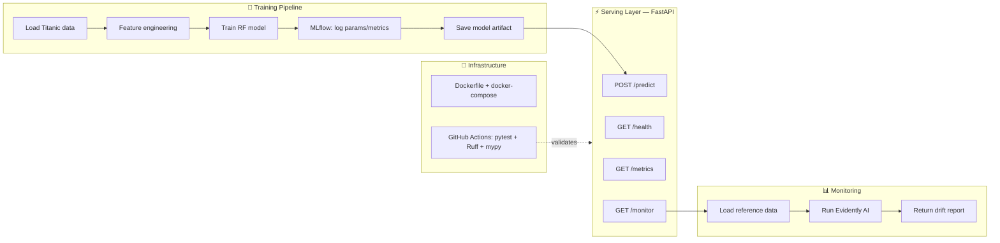

# ⚙️ Production ML Service

[](https://github.com/vijendrapokharkar15-design/DS-AI-75D/actions/workflows/ml_pipeline_ci.yml)

A production-style ML service: a model trained and tracked with MLflow, served through FastAPI...

A production-style ML service: a model trained and tracked with MLflow, served through FastAPI with health/metrics/monitoring endpoints, containerized with Docker, and validated by a GitHub Actions CI/CD pipeline. Built as Project 4 of my 75-day DS/AI roadmap.

---

## Problem

Training a model is the easy part. The goal here was to build what actually separates a notebook from a production system: experiment tracking, a real serving API (not just a Streamlit demo), automated testing/linting on every push, and live drift monitoring that flags when incoming data starts to diverge from what the model was trained on.

## Architecture



## Endpoints

| Endpoint | Method | Purpose |
|---|---|---|
| `/predict` | POST | Single prediction with confidence score |
| `/health` | GET | Model status + version + uptime |
| `/metrics` | GET | Prediction count + performance stats |
| `/monitor` | GET | Live Evidently AI drift report vs. reference data |

## Results

| Metric | Value |
|---|---|
| AUC | 0.9635 |
| Accuracy | 97.5% |

## Tech Stack

| Layer | Tools |
|---|---|
| Training | scikit-learn, MLflow |
| Serving | FastAPI, uvicorn |
| Packaging | Docker, docker-compose |
| CI/CD | GitHub Actions (pytest, Ruff, mypy) |
| Monitoring | Evidently AI |
| Storage | Local (MLflow) — S3 in production |

## How to Run Locally

**Option 1 — Directly:**
```bash
git clone https://github.com/vijendrapokharkar15-design/DS-AI-75D.git
cd DS-AI-75D/.vscode/week10/ml_service
pip install -r requirements.txt
uvicorn app:app --reload
```

**Option 2 — With Docker:**
```bash
cd DS-AI-75D/.vscode/week10/ml_service
docker compose up --build
```

## CI/CD

Every push runs a GitHub Actions pipeline (`ml_pipeline_ci.yml`) that lints with Ruff, type-checks with mypy, and runs the pytest suite before anything is considered deployable. `bad_code.py` in this folder is a deliberately broken file used to sanity-check that the linting step actually catches style violations.

## Part of DS-AI-75D Journey

This project is part of my [75-Day Data Science & AI Roadmap](https://github.com/vijendrapokharkar15-design/DS-AI-75D) — built on Day 70 (Phase 5